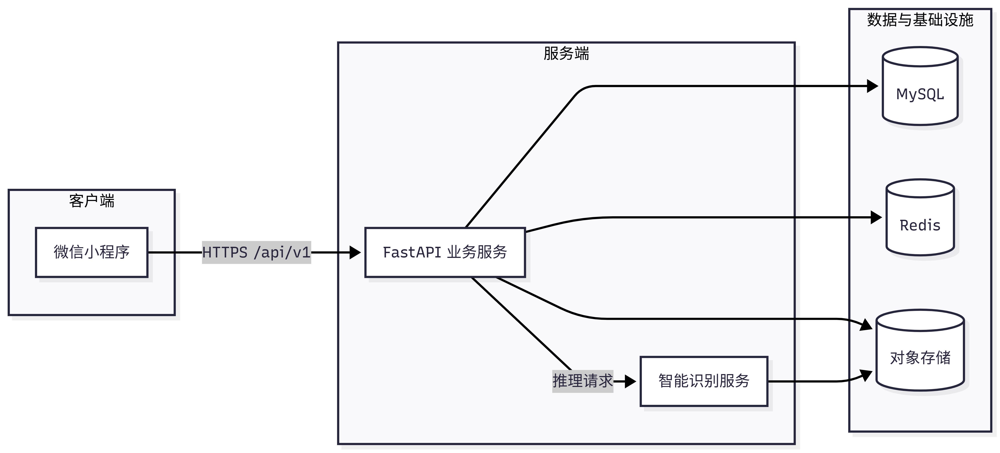
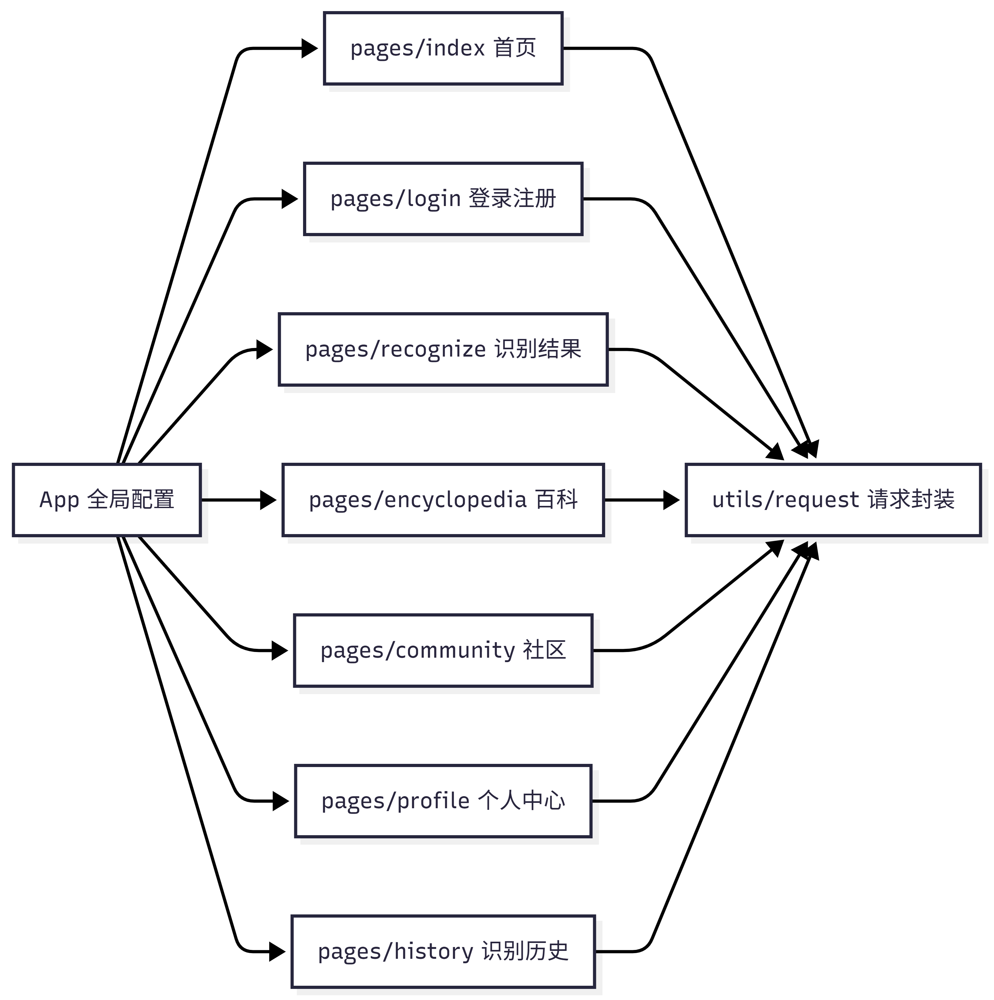
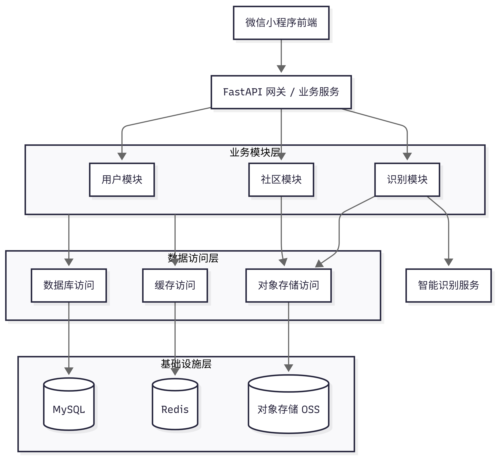
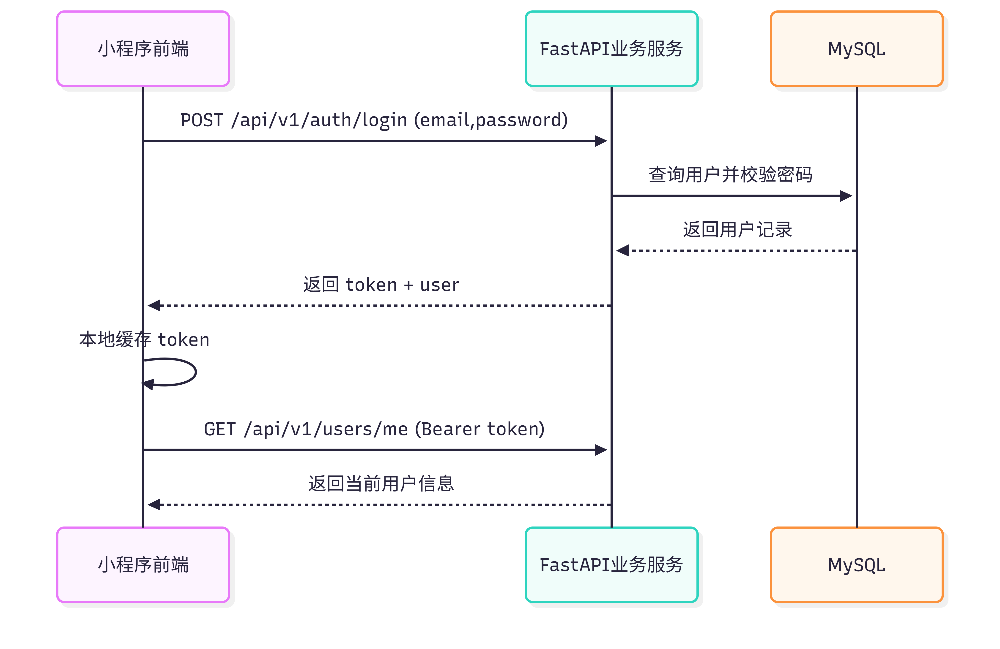
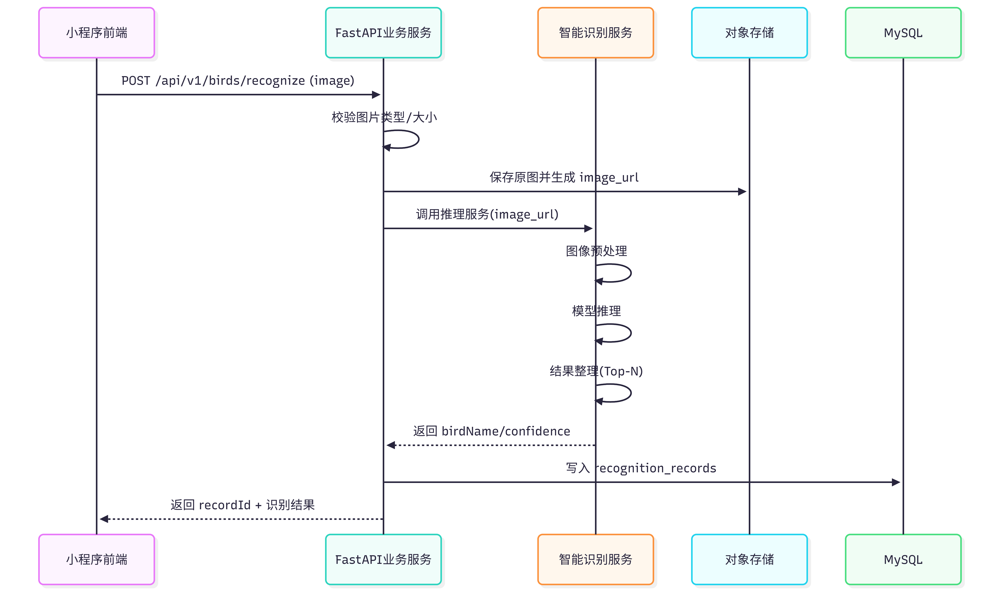
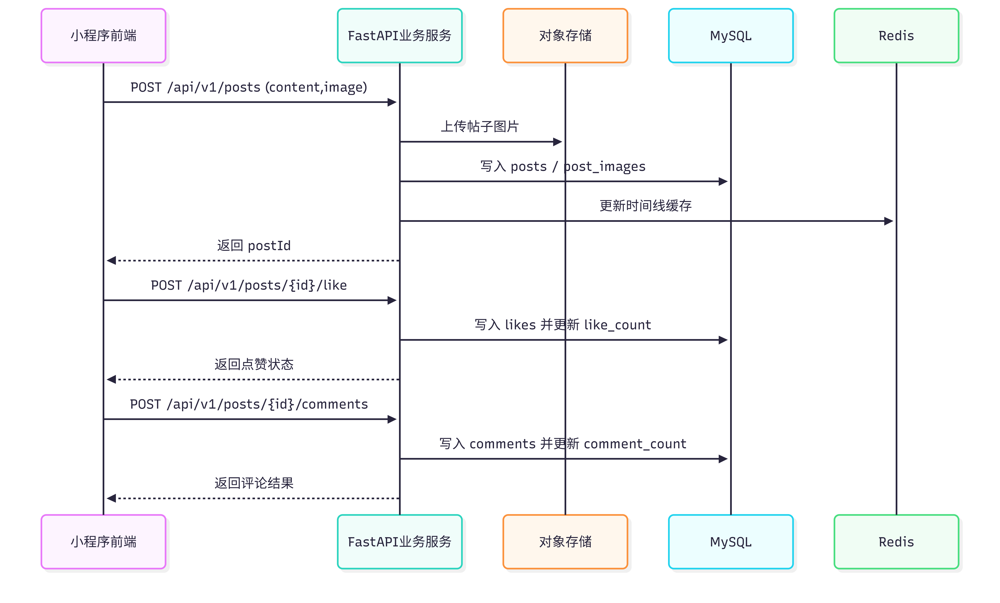

# AviAI 系统架构设计文档

## 系统总体架构图

AviAI 采用“微信小程序前端 + FastAPI 业务服务 + 独立智能识别服务 + 数据基础设施”的分层架构。前端负责交互与展示，业务服务负责接口与业务编排，识别服务专注模型推理，MySQL/Redis/对象存储分别处理结构化数据、缓存状态和图片文件。

## 前端架构（页面/组件结构）

前端采用原生微信小程序实现，工程由 `app.js/app.json` 管理全局配置，业务页面放在 `pages/`，网络和工具能力放在 `utils/`。页面结构围绕核心路径组织：登录注册、首页识别、识别结果、鸟类详情、社区、个人中心与识别历史。

页面层面采用“入口页 + 业务页 + 详情页”的组织方式：首页提供拍照/上传入口；识别结果页负责展示鸟类名称、置信度和推荐入口；百科和社区分别承载知识查询与用户互动；个人中心统一管理账号与历史记录。

组件层面采用可复用思路拆分：搜索栏、结果卡片、帖子卡片、评论输入框、加载与空状态提示等组件由页面复用；请求由 `utils/request.js` 统一封装，统一处理 Token、错误提示和响应格式。

## 后端架构（服务/模块划分）

后端使用 FastAPI 提供统一 REST 接口，统一前缀为 `/api/v1`。业务服务内部按“接口层 -> 业务层 -> 数据访问层”组织，接口层负责参数校验和鉴权，业务层处理用户、识别、社区逻辑，数据访问层负责数据库操作和事务。

智能识别服务独立部署，不直接暴露给前端。业务服务收到图片后先做文件校验和存储，再调用识别服务完成图像预处理、模型推理和结果整理，最后将结果写入识别记录并返回给前端。这样的拆分可以降低耦合，便于模型单独迭代。

后端模块分工如下：
- 用户模块：注册、登录、Token 鉴权、用户资料
- 识别模块：图片上传、识别任务、识别历史
- 社区模块：发帖、评论、点赞、时间线读取
- 识别服务：预处理、模型推理、结果标准化
- 基础设施：MySQL、Redis、对象存储、日志与监控

## 系统交互流程

系统交互可以拆成三条主流程：登录鉴权、图片识别、社区互动。三条流程都遵循统一返回格式（`code/message/data`）和统一错误处理规则。

### 1. 登录与鉴权流程

1. 用户在小程序输入邮箱和密码，前端调用 `POST /api/v1/auth/login`。  
2. 后端查询用户并校验密码哈希，成功后签发 JWT。  
3. 前端保存 Token，后续受保护接口统一通过 `Authorization: Bearer <token>` 访问。  
4. 后端在中间件中校验 Token，校验通过后才进入业务逻辑。  

### 2. 图片识别流程

1. 用户拍照或从相册选择图片，前端以 `multipart/form-data` 上传到 `POST /api/v1/birds/recognize`。  
2. 后端校验图片类型、大小与安全规则，通过后上传到对象存储。  
3. 后端调用智能识别服务，识别服务完成预处理、模型推理和结果排序。  
4. 后端将结果写入 `recognition_records`，并返回鸟类名称、置信度和记录 ID。  
5. 前端展示识别结果，并提供跳转到百科详情或历史记录的入口。  

### 3. 社区发布与互动流程

1. 用户发布帖子时，前端提交文本与图片到 `POST /api/v1/posts`。  
2. 后端完成鉴权和内容校验，图片写入对象存储，帖子和图片关系写入 MySQL。  
3. 用户点赞和评论分别调用 `/posts/{postId}/like`、`/posts/{postId}/comments`。  
4. 后端写入互动数据并更新计数；热点时间线可写入 Redis 以提升读性能。  
5. 前端收到结果后局部刷新帖子状态，不需要整页重载。  

