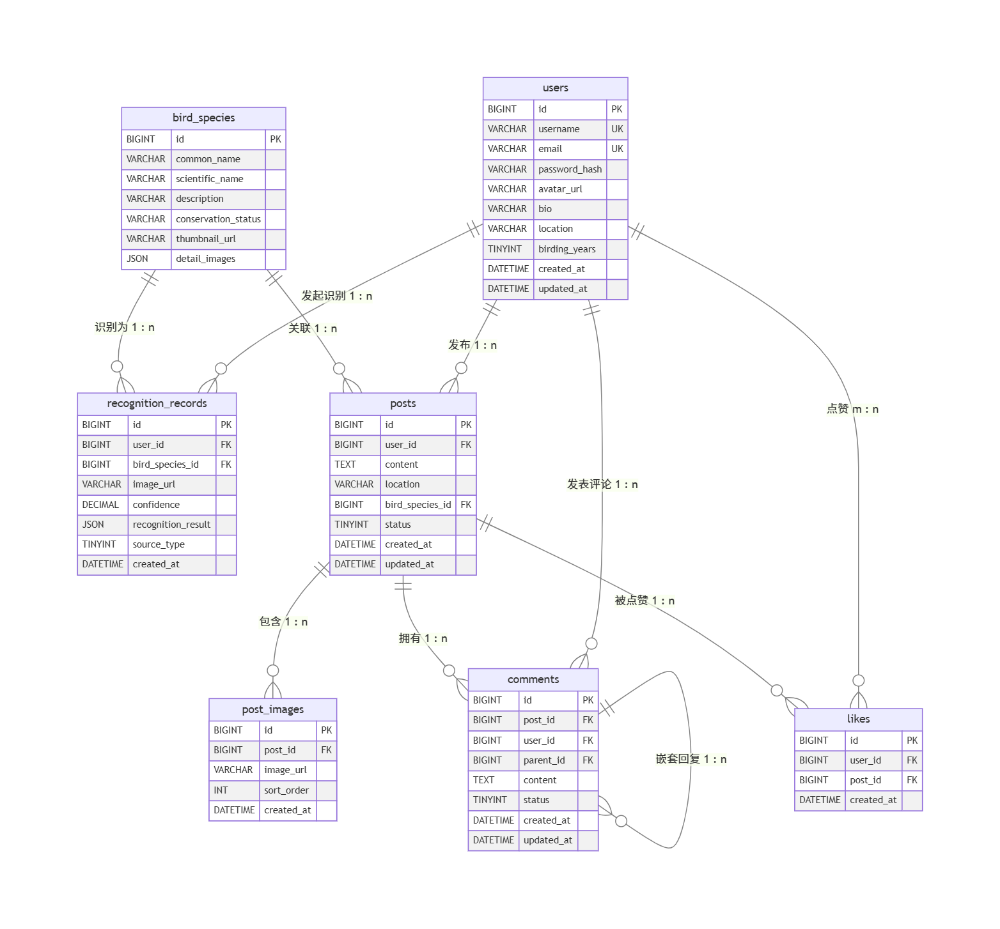

# AviAI - 数据库设计文档

## 1. 文档概述
本文档为AviAI鸟类识别app设计完整的数据库设计方案。该App支持用户注册登录、鸟类图片识别（拍摄或从本地选取）、鸟类百科浏览、社区分享互动以及个人中心管理等功能。数据库系统采用MySQL，并辅以OSS存储图片等非结构化数据。

## 2. 设计原则
- **数据一致性**：使用外键约束保证关联数据的完整性。
- **扩展性**：预留字段，适应未来功能扩展。
- **性能优化**：合理设计索引，满足高频查询需求。
- **安全性**：敏感字段加密存储，遵循最小权限原则。

## 3. 表结构详细设计

### 3.1 用户表（users）
存储用户账号信息及个人资料。
| 字段名        | 数据类型         | 约束                                                            | 描述                     |
| ------------- | ---------------- | --------------------------------------------------------------- | ------------------------ |
| id            | BIGINT UNSIGNED  | PRIMARY KEY, AUTO_INCREMENT                                     | 用户唯一ID               |
| username      | VARCHAR(50)      | NOT NULL, UNIQUE                                                | 用户名，用于登录         |
| email         | VARCHAR(100)     | NOT NULL, UNIQUE                                                | 邮箱，用于登录和找回密码 |
| password_hash | VARCHAR(255)     | NOT NULL                                                        | 加密后的密码（如bcrypt） |
| avatar_url    | VARCHAR(500)     |                                                                 | 头像存储URL              |
| bio           | VARCHAR(200)     |                                                                 | 个人简介                 |
| location      | VARCHAR(100)     |                                                                 | 所在地                   |
| birding_years | TINYINT UNSIGNED |                                                                 | 观鸟年限（年）           |
| created_at    | DATETIME         | NOT NULL, DEFAULT CURRENT_TIMESTAMP                             | 注册时间                 |
| updated_at    | DATETIME         | NOT NULL, DEFAULT CURRENT_TIMESTAMP ON UPDATE CURRENT_TIMESTAMP | 更新时间                 |

**索引**：
- `idx_username`：username
- `idx_email`：email

### 3.2 鸟类物种表（bird_species）
存储可供识别的鸟类物种信息，即鸟类百科数据源。
| 字段名              | 数据类型         | 约束                                                             | 描述                                              |
| ------------------- | --------------- | --------------------------------------------------------------- | ------------------------------------------------- |
| id                  | BIGINT UNSIGNED | PRIMARY KEY, AUTO_INCREMENT                                     | 物种唯一ID                                         |
| common_name         | VARCHAR(100)    | NOT NULL                                                        | 鸟类常用名（如“家燕”）                              |
| scientific_name     | VARCHAR(150)    | NOT NULL                                                        | 学名（如“Hirundo rustica”）                        |
| description         | VARCHAR(255)    |                                                                 | 科、目、物种描述、特征、习性、栖息地描述、分布范围等   |
| conservation_status | VARCHAR(50)     |                                                                 | 保护等级（如LC, NT, VU等）                         |
| thumbnail_url       | VARCHAR(500)    |                                                                 | 缩略图URL                                         |
| detail_images       | JSON            |                                                                 | 详细图片URL列表（可存储数组JSON）                   |

**索引**：
- `idx_common_name`：common_name
- `idx_scientific_name`：scientific_name
- `idx_conservation_status`：conservation_status

### 3.3 识别记录表（recognition_records）
存储用户每次识别操作的历史记录。
| 字段名             | 数据类型        | 约束                                | 描述                                         |
| ------------------ | --------------- | ----------------------------------- | -------------------------------------------- |
| id                 | BIGINT UNSIGNED | PRIMARY KEY, AUTO_INCREMENT         | 记录ID                                       |
| user_id            | BIGINT UNSIGNED | NOT NULL, FOREIGN KEY (users.id)    | 发起识别的用户ID                             |
| bird_species_id    | BIGINT UNSIGNED | FOREIGN KEY (bird_species.id)       | 识别出的物种ID，可为空（识别失败时）         |
| image_url          | VARCHAR(500)    | NOT NULL                            | 上传/拍摄的图片存储URL                       |
| confidence         | DECIMAL(4,2)    |                                     | 识别置信度（0.00~100.00）                    |
| recognition_result | JSON            |                                     | 详细识别结果（可能返回多个候选物种及置信度） |
| source_type        | TINYINT         | NOT NULL                            | 图片来源：1-拍摄，2-本地相册                 |
| created_at         | DATETIME        | NOT NULL, DEFAULT CURRENT_TIMESTAMP | 识别时间                                     |

**索引**：
- `idx_user_id`：user_id
- `idx_bird_species_id`：bird_species_id
- `idx_created_at`：created_at

### 3.4 社区帖子表（posts）
存储用户在分享社区中发布的图文内容。
| 字段名          | 数据类型        | 约束                                                            | 描述                          |
| --------------- | --------------- | --------------------------------------------------------------- | ----------------------------- |
| id              | BIGINT UNSIGNED | PRIMARY KEY, AUTO_INCREMENT                                     | 帖子ID                        |
| user_id         | BIGINT UNSIGNED | NOT NULL, FOREIGN KEY (users.id)                                | 发布者ID                      |
| content         | TEXT            | NOT NULL                                                        | 帖子的文字内容                |
| location        | VARCHAR(200)    |                                                                 | 拍摄地点（可选）              |
| bird_species_id | BIGINT UNSIGNED | FOREIGN KEY (bird_species.id)                                   | 关联的鸟类物种（可选）        |
| status          | TINYINT         | NOT NULL, DEFAULT 1                                             | 帖子状态：1-正常，0-删除/隐藏 |
| created_at      | DATETIME        | NOT NULL, DEFAULT CURRENT_TIMESTAMP                             | 发布时间                      |
| updated_at      | DATETIME        | NOT NULL, DEFAULT CURRENT_TIMESTAMP ON UPDATE CURRENT_TIMESTAMP | 最后编辑时间                  |

**索引**：
- `idx_user_id`：user_id
- `idx_bird_species_id`：bird_species_id
- `idx_created_at`：created_at

### 3.5 帖子图片表（post_images）
一对多存储帖子关联的图片（支持多图）。
| 字段名     | 数据类型        | 约束                                               | 描述        |
| ---------- | --------------- | -------------------------------------------------- | ----------- |
| id         | BIGINT UNSIGNED | PRIMARY KEY, AUTO_INCREMENT                        | 图片记录ID  |
| post_id    | BIGINT UNSIGNED | NOT NULL, FOREIGN KEY (posts.id) ON DELETE CASCADE | 所属帖子ID  |
| image_url  | VARCHAR(500)    | NOT NULL                                           | 图片存储URL |
| sort_order | INT             | NOT NULL, DEFAULT 0                                | 排序序号    |
| created_at | DATETIME        | NOT NULL, DEFAULT CURRENT_TIMESTAMP                | 上传时间    |

**索引**：
- `idx_post_id`：post_id

### 3.6 评论表（comments）
用户对社区帖子的评论。
| 字段名     | 数据类型        | 约束                                                            | 描述                                     |
| ---------- | --------------- | --------------------------------------------------------------- | ---------------------------------------- |
| id         | BIGINT UNSIGNED | PRIMARY KEY, AUTO_INCREMENT                                     | 评论ID                                   |
| post_id    | BIGINT UNSIGNED | NOT NULL, FOREIGN KEY (posts.id) ON DELETE CASCADE              | 所属帖子ID                               |
| user_id    | BIGINT UNSIGNED | NOT NULL, FOREIGN KEY (users.id)                                | 评论者ID                                 |
| parent_id  | BIGINT UNSIGNED | FOREIGN KEY (comments.id)                                       | 父评论ID，支持嵌套回复，NULL表示一级评论 |
| content    | TEXT            | NOT NULL                                                        | 评论内容                                 |
| status     | TINYINT         | NOT NULL, DEFAULT 1                                             | 状态：1-正常，0-删除                     |
| created_at | DATETIME        | NOT NULL, DEFAULT CURRENT_TIMESTAMP                             | 评论时间                                 |
| updated_at | DATETIME        | NOT NULL, DEFAULT CURRENT_TIMESTAMP ON UPDATE CURRENT_TIMESTAMP | 更新时间                                 |

**索引**：
- `idx_post_id`：post_id
- `idx_user_id`：user_id
- `idx_parent_id`：parent_id

### 3.7 点赞表（likes）
记录用户对帖子的点赞行为，防止重复点赞。
| 字段名     | 数据类型        | 约束                                               | 描述         |
| ---------- | --------------- | -------------------------------------------------- | ------------ |
| id         | BIGINT UNSIGNED | PRIMARY KEY, AUTO_INCREMENT                        | 点赞记录ID   |
| user_id    | BIGINT UNSIGNED | NOT NULL, FOREIGN KEY (users.id)                   | 点赞用户ID   |
| post_id    | BIGINT UNSIGNED | NOT NULL, FOREIGN KEY (posts.id) ON DELETE CASCADE | 被点赞帖子ID |
| created_at | DATETIME        | NOT NULL, DEFAULT CURRENT_TIMESTAMP                | 点赞时间     |

**唯一约束**：`UNIQUE KEY uk_user_post (user_id, post_id)`

**索引**：
- `idx_post_id`：post_id

## 数据库ER图

